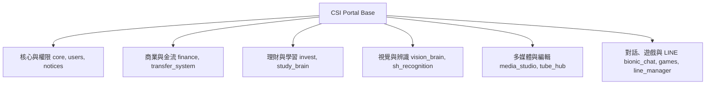

# CSI Server Portal - 入口網站開發說明

  

這是一個基於 **Django 6.0.x** 與 **MySQL 8.x** 建立的多功能整合入口網站系統（CSI Portal），具備豐富的商業管理與 AI 應用模組。專案支援 **Google OAuth 2.0** 登入、**WebSocket (Daphne)** 即時通訊與 **Docker** 容器化部署，並結合了多種先進的機器學習與雲端 AI 引擎。

*   **最新版本**：`v1.16.0`
*   **更新摘要**：[點此查看完整變更歷程 (CHANGELOG.md)](CHANGELOG.md)

---

## 📑 目錄
- [環境需求](#環境需求)
- [專案架構與 App 模組說明](#專案架構與-app-模組說明)
- [核心技術與依賴元件](#核心技術與依賴元件)
- [開發起步 (Local 模式)](#開發起步-local-模式)
- [Docker 運作流程 (核心開發)](#docker-運作流程-核心開發)
- [資料庫與帳號管理](#資料庫與帳號管理)
- [管理工具與排程任務](#管理工具與排程任務)
- [專案註解規範](#專案註解規範)
- [Google OAuth 設定提醒](#google-oauth-設定提醒)

---

## 環境需求

| 項目 | 需求版本 / 說明 |
| :--- | :--- |
| **Python** | 3.13+ |
| **Database** | MySQL 8.x (生產環境) / SQLite (本機快速測試) |
| **Container** | Docker & Docker Compose |
| **OAuth** | Google Cloud Platform OAuth 2.0 Client ID |
| **外部工具** | `FFmpeg` (影音處理), `Tesseract-OCR` (光學字元辨識) |

---

## 專案架構與 App 模組說明

專案採用高度模組化的 App 設計，以下為系統內各個子應用的主要功能說明：



### 1. 核心與權限管理
*   **[core](file:///d:/SI1403/dennis/csi_server/core/)**：提供全域功能開關 (`FeatureStatus`)、發文簿字號系統 (`ticket_pull`)、Gemini 智能客服入口 (`portal_ai_bot`) 以及企業資訊 PDF 下載權限校驗。
*   **[users](file:///d:/SI1403/dennis/csi_server/users/)**：擴充 Django `User` 個人檔案 (`Profile`)，包含上傳頭像自動高品質剪裁縮放（LANCZOS 300x300）、自動 EXIF 轉正，以及符合企業網域（`settings.CSI_EMAIL`）時自動提升為員工之信號量邏輯。
*   **[notices](file:///d:/SI1403/dennis/csi_server/notices/)**：系統公告管理（支援置頂功能）、外部工具連結設定以及基於 Session 計數的每日/全站瀏覽量統計（`SiteVisit`）。

### 2. 金流與流轉系統
*   **[finance](file:///d:/SI1403/dennis/csi_server/finance/)**：儲值方案與點數商城系統。串接綠界金流付款，提供「儲值點數」與「紅利點數」雙錢包。扣點交易透過資料庫鎖 `select_for_update` 防止併發超賣。
*   **[transfer_system](file:///d:/SI1403/dennis/csi_server/transfer_system/)**：使用 `django-fsm-2` 有限狀態機管理的物品轉移系統。包含物品定義與 `pending` -> `accepted`/`rejected`/`cancelled` 的流轉工作流。

### 3. 理財與學習中心
*   **[invest](file:///d:/SI1403/dennis/csi_server/invest/)**：記帳與股價追蹤系統。可建立投資組合並設定月被動收入目標。交易異動時利用 Django 信號自動重新累加計算持股成本與已實現損益。內嵌基於 Gemini 的 AI 理財規劃顧問。
*   **[study_brain](file:///d:/SI1403/dennis/csi_server/study_brain/)**：AI 輔助學習平台。支援 PDF/Word/影片上傳。AI 自動產生重點摘要與練習題；紀錄測驗錯誤並生成錯題本；提供單題 AI 深度觀念解析與延伸複習題。

### 4. 視覺與機器學習
*   **[vision_brain](file:///d:/SI1403/dennis/csi_server/vision_brain/)**：提供 OCR 文字辨識（PaddleOCR 與 Tesseract-OCR）與 YOLOv11 即時物件偵測，利用記憶體快取避免模型重複載入。
*   **[sh_recognition](file:///d:/SI1403/dennis/csi_server/sh_recognition/)**：世祥辨識專用模組。支援上傳自訂訓練的 RT-DETRv2 (`.pth`) 模型，在 CPU 上執行批次圖片推論並繪製 bounding boxes 進行品質檢測。

### 5. 影音與多媒體編輯
*   **[media_studio](file:///d:/SI1403/dennis/csi_server/media_studio/)**：多媒體剪輯工作室。支援圖片無損壓縮、WEBP 轉檔、AI 背景去背（整合 `rembg`），以及多段影片的時間軸裁切與 libx264/AAC 轉碼拼接。
*   **[tube_hub](file:///d:/SI1403/dennis/csi_server/tube_hub/)**：YouTube 影音下載工具。利用 `yt-dlp` 下載影片或 KTV 音訊檔，並透過 `youtube-transcript-api` 自動抓取中、英、日字幕，提供線上隨堂學習筆記功能。

### 6. AI 對話、遊戲與 LINE 整合
*   **[bionic_chat](file:///d:/SI1403/dennis/csi_server/bionic_chat/)**：虛擬人物語音對話系統。以 `llama-cpp-python` 載入本地 LLM 模型，透過 SSE (Server-Sent Events) 串流輸出文字，並於斷句時自動將繁體中文回覆翻譯並生成 `edge-tts` 語音音檔串流播放。
*   **[games](file:///d:/SI1403/dennis/csi_server/games/)**：綜合網頁遊戲中心與 Godot API 接口。提供「倖存者生存」（Vampire Survivor 網頁版/ Godot Token 驗證存檔）、「虛擬人生」（大富翁地圖事件）以及「魔塔 RPG」（五層地圖、存檔資料序列化與局外金幣升級）三款遊戲。
*   **[line_manager](file:///d:/SI1403/dennis/csi_server/line_manager/)**：LINE 官方帳號行程管理與隱私防護系統。支援 Google 帳戶合併綁定、歷史行程自動移轉、`GroupMembership` 成員關係動態追蹤（群組行程自動同步共享）、LINE LIFF 網頁端行程面板，且核心行程資料欄位在資料庫層進行對稱加密，以防後台窺探。

---

## 核心技術與依賴元件

*   **Web 核心**：Django 6.0.5, Gunicorn 26.0.0, WhiteNoise 6.12.0
*   **即時通訊**：Daphne 4.2.1, Django Channels 4.3.2
*   **資料庫連接**：MySQLClient 2.2.8, PyODBC 5.3.0
*   **LINE 整合**：LINE Messaging API SDK (line-bot-sdk 3.7.0)
*   **資料庫加密**：django-encrypted-model-fields 0.6.5 (對稱式 Fernet 加密)
*   **AI 與 OCR**：
    *   Google GenAI SDK (google-genai 2.6.0)
    *   YOLOv11 Object Detection (ultralytics 8.4.54)
    *   PaddleOCR 3.5.0, PaddlePaddle 3.3.1
    *   PyTesseract 0.3.13 (需安裝 Tesseract-OCR 執行檔)
    *   Llama.cpp Python bindings (llama-cpp-python)
*   **多媒體處理**：
    *   FFmpeg-Python 0.2.0 (系統需安裝 FFmpeg)
    *   Edge-TTS 7.2.8 (微軟語音合成)
    *   Rembg 1.4.0 (AI 圖片去背)
    *   YTDL-P 2026.03.17, YouTube-Transcript-API 1.2.4

---

## 開發起步 (Local 模式)

如果您想在本機環境（非 Docker）進行初步測試，請依照以下步驟操作：

```bash
# 1. 複製專案並進入目錄
git clone <your-gitlab-repo-url> csi_server && cd csi_server

# 2. 建立 Python 虛擬環境 (venv)
python -m venv .venv

# 3. 啟用虛擬環境
# Windows Powershell:
.venv\Scripts\Activate.ps1
# Mac/Linux:
source .venv/bin/activate

# 4. 安裝必要套件與依賴項
pip install -r requirements.txt

# 5. 複製並設定 .env 變數 (包含 DB 連線字串、Google GCP OAuth 與 Gemini API Key)
cp .env.example .env  # 請視專案內是否有範本，或手動建立 .env

# 6. 初始化資料庫遷移
python manage.py migrate

# 7. 建立管理員 (Superuser)
python manage.py createsuperuser

# 8. 收集靜態檔案
python manage.py collectstatic --noinput

# 9. 啟動開發伺服器
python manage.py runserver
```

---

## Docker 運作流程 (核心開發)

這是本專案推薦的協同開發方式，確保跨團隊環境的一致性。

```bash
# 建立並啟動所有容器 (修改 Dockerfile 或新增/更動 requirements.txt 套件後使用)
docker compose up --build

# 背景啟動 (僅修改 .py 或 .html 檔案後快速重新啟動)
docker compose up -d

# 徹底關閉並移除容器 (確保環境變數重載與清理暫存網絡)
docker compose down

# 停止容器並一併刪除資料庫 Volume (⚠️ 注意：資料庫資料會被清空)
docker compose down -v
```

---

## 資料庫與帳號管理

透過 Docker 指令與容器內的 Django 進行互動：

```bash
# 執行資料庫遷移 (套用新 Model)
docker compose exec web python manage.py migrate

# 建立資料庫遷移檔 (在 models.py 異動後執行)
docker compose exec web python manage.py makemigrations

# 建立管理員帳戶
docker compose exec web python manage.py createsuperuser

# 啟動增強版 Shell (自動匯入所有 Model 方便 Debug)
docker compose exec web python manage.py shell_plus
```

---

## 管理工具與排程任務

*   **股價初始化**（匯入台股清單）：
    ```bash
    python manage.py init_twse
    ```
*   **更新股價資訊**（手動執行爬蟲）：
    ```bash
    python manage.py update_prices
    ```
*   **啟動排程更新服務**（需開獨立終端機常駐執行，自動於週一至週五 14:30 爬取股價）：
    ```bash
    python manage.py start_scheduler
    ```
*   **語系翻譯與編譯**（支援繁中、英文、日文多國語系）：
    ```bash
    # 產生翻譯檔
    PYTHONIOENCODING=utf-8 python manage.py makemessages -l zh_Hant -l en -l ja -i ".venv" -i "*.txt" -i "test*"
    # 編譯翻譯檔
    python manage.py compilemessages -l zh_Hant -l en -l ja -i .venv
    ```

---

## 專案註解規範

為保持多人協作代碼的可讀性，專案代碼開發中必須遵循以下註解標籤：

*   `'#!'`：用於**功能塊初始化、大標題、核心關鍵邏輯**說明。
*   `'#*'`：用於**設定值解釋、開發者提示或關鍵注意事項**。
*   `'#?'`：用於標示**區域分隔區塊**。

---

## Google OAuth 設定提醒

1.  **Client ID**：必須於 `.env` 中正確設定 `GOOGLE_CLIENT_ID` 與 `GOOGLE_CLIENT_SECRET`。
2.  **Redirect URI**：Google GCP Console 的 OAuth 允許重導向網址必須包含 `http://127.0.0.1:8000/accounts/google/login/callback/`。
3.  **Site ID**：進入 Django Admin 後台將預設的 `example.com` 站台網域修改為 `127.0.0.1:8000`，否則 OAuth 登入完跳轉時會產生站台 ID 錯誤。
4.  **Root URL**：確認 `config/urls.py` 中有配置首頁空路徑導向首頁，以防登入跳轉時發生 404 錯誤。
